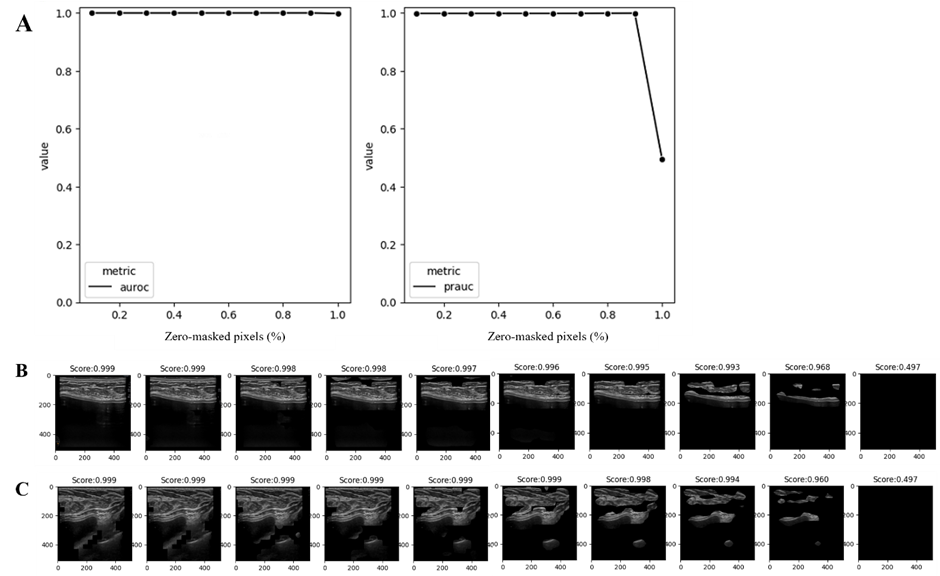

### Developing a deep learning model to predict the breast implant texture types with ultrasonographic image: feasibility study 
- Ho Heon Kim, MS.1; Won Chan Jeong2;  Kyungran Pi, MS.,2 ; *Jae Hong Kim, M.D.,3
1. Department of Biomedical Informatics, Medical School of Yonsei University, Seoul
2. 3Billion, Inc, Seoul, South Korea
3. Qauntic EMBA
4. THE W Clinic, Seoul, Korea

#### Classification performance for shell surface type 
- From stratified 5-fold cross validation, our model showed average AUROC of 0.98, and PRAUC of 0.88 in Canon dataset captured with Canon ultrasonography device (D1) (Figure 1-A, B). Overall, our model performed with an AUROC of 0.98 to 1.00, a PRAUC of 0.68 to 0.99 in Canon dataset (D1). Although the images were captured with GE ultrasonography device (D2), we identified our model showed AUROC of 0.985, and PRAUC of 0.748 (Figure 1-C, D). For publicly available dataset (D5), the model showed 0.909 of AUROC and 0.958 of PRAUC (Supplementary data 1).

#### Quantitative validation
- In the quantitative analysis to determine whether our model classifies ultrasonography images in accordance with medical knowledge, the model maintained an AUROC of 0.999 up to masking 90% of less contribution pixel to prediction, and showed AUROC of 0.997 when masking 100% of pixels. However, the PRAUC remained at 0.999 even after masking 90% of the pixels. After that, it decreased to 0.493 when all pixels were masked (Figure 2 -A). For each individual case, the confidence for the texture shell type remained at 0.993 even when 80% of less contributing pixels were masked. At 90% of masking pixels, model confidence dropped into 0.968, and reached 0.497 when all of pixels were masked. Similarly, the model confidence for another case with texture shell types was maintained 0.994 until masking 80% of the pixels, decreased into 0.960 when masking 90% of pixels, dropped into 0.947 when masking 100% the of pixels (Figure 2-B, C).

#### Uncertainty estimation
- The model did not significantly produce lower entropies for the test dataset in Canon data (D1) than for the external validation set from GE ultrasonography device (mean [SD], 0.072[0.201] vs 0.066 [0.21]; p=0.350). However, the average entropy for ruptured implant images showed significantly high than for the test dataset in Canon data (mean [SD], 0.371 [0.318] vs 0.072[0.201]; p<.001). Moreover, model also predicted statistically significant high for the absent of implant image than for ruptured implant images (mean [SD], 0.777 [0.199] vs 0.371 [0.318]; p<.001) (Figure 3).

#### Individual case review
- For qualitative case review, we sampled two ultrasonography images; one from the test dataset (Canon, D1), and another from the ruptured implant datasets (D3), both captured by the same device. The model provided the model confidence of 0.998 as texture type for the texture shell type image. The Grad-CAM score for texture type showed the high value at shell in heatmap with Grad-CAM (white horizontal line in Figure 4-A). Also, for the image of ruptured texture shell implant, the model provided the model confidence of 0.664 as texture type. Although this score is higher than the classification threshold (0.5), it is lower than that of the intact texture shell type implant. However, the Grad-CAM showed high in the adjacent intact layer from ruptured shell area in the heatmap, despite the shell being ruptured due to shell tear (Figure 4-B).

